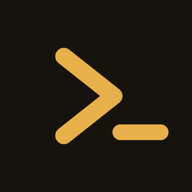
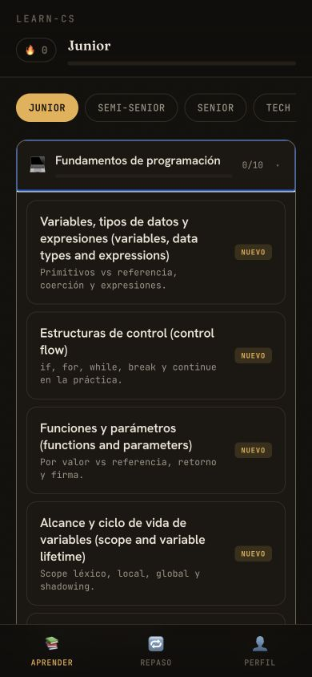
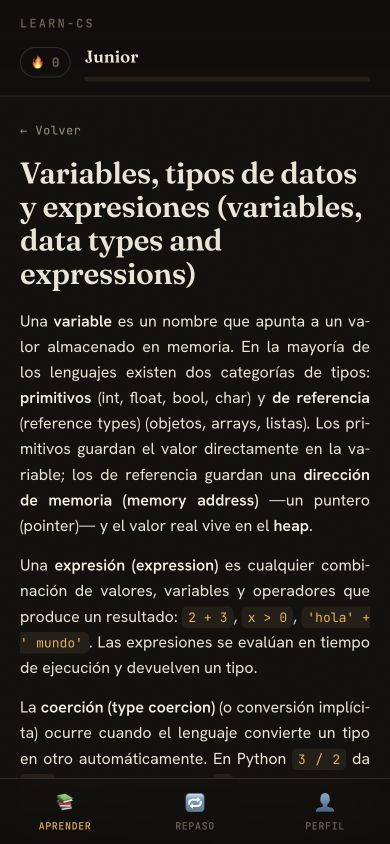
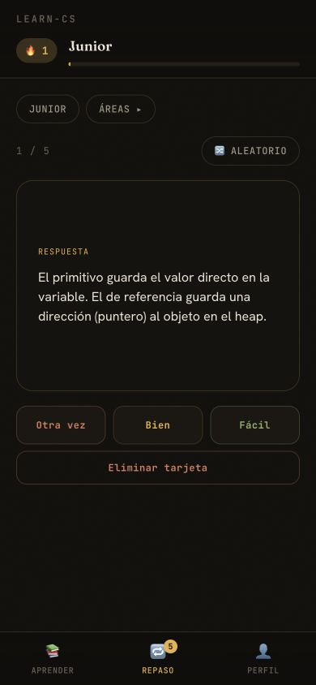

<div align="center">
  
  <h1>learn-cs</h1>
  <p>Una PWA en español para entender y retener fundamentos de Computer Science.</p>

  [](https://github.com/PucciRomeroTobias/learn-cs/actions/workflows/ci.yml)
  [](LICENSE)
  [](https://learn-cs-psi.vercel.app)

  **[Probar la aplicación](https://learn-cs-psi.vercel.app)**
</div>

## Qué es

learn-cs combina lecciones cortas con flashcards de repetición espaciada. La interfaz está pensada para usarse como una app de iOS y reemplazar unos minutos de scroll por una sesión de estudio.

- **Aprender:** contenido organizado por nivel y área, con ejemplos de código y diagramas.
- **Repasar:** tarjetas programadas con una variante simple de SM-2 y tres grados de dificultad.
- **Seguir el progreso:** nivel, lecciones completadas y racha diaria.
- **Usar sin cuenta:** todo queda en el navegador y se puede exportar o restaurar como JSON.

El contenido está en español e incluye 180 lecciones y más de 900 tarjetas sobre fundamentos, algoritmos, estructuras de datos, bases de datos, redes, sistemas operativos, testing, seguridad y system design.

## Capturas

| Explorar el temario | Leer una lección | Repasar tarjetas |
| --- | --- | --- |
|  |  |  |

## Ejecutar localmente

Requisitos: [Node.js](https://nodejs.org/) 20 o superior y npm.

```bash
git clone https://github.com/PucciRomeroTobias/learn-cs.git
cd learn-cs
npm ci
npm run dev
```

Vite muestra la URL local, normalmente `http://localhost:5173`.

Comandos disponibles:

```bash
npm test          # valida contenido, referencias e IDs únicos
npm run build     # genera el build de producción en dist/
npm run preview   # sirve el build de producción localmente
npm run check     # ejecuta validación y build
```

## Instalar como app en iOS

1. Abrí la [aplicación](https://learn-cs-psi.vercel.app) en Safari.
2. Tocá **Compartir**.
3. Elegí **Agregar a inicio**.

La PWA se abre en modo standalone y mantiene el progreso en ese dispositivo. Para cambiar de navegador o dispositivo, exportá primero un backup desde **Perfil**.

## Deploy en Vercel

1. Importá este repositorio en [Vercel](https://vercel.com/new).
2. Elegí el preset **Vite**.
3. Usá `npm run build` como Build Command y `dist` como Output Directory.
4. Publicá el proyecto.

No necesita variables de entorno ni servicios externos. El archivo `vercel.json` agrega los headers de seguridad. Una vez conectado el repositorio, cada push a `main` genera un nuevo deploy.

También podés servir `dist/` desde cualquier hosting estático con HTTPS. HTTPS es necesario para registrar el service worker fuera de `localhost`.

## Agregar contenido

La metadata general vive en `src/content/_meta.json`; las lecciones están separadas por área en `src/content/*.json`. No cambies IDs ya publicados: el progreso en `localStorage` los usa como clave.

La guía de estructura, validación y pull requests está en [CONTRIBUTING.md](CONTRIBUTING.md).

## Privacidad y seguridad

La aplicación no tiene backend, login ni analytics. El progreso nunca se sincroniza: se almacena en `localStorage` y sólo sale del navegador si exportás un backup.

El Markdown se sanitiza antes de renderizarse, Mermaid usa su modo estricto, el deploy incluye una Content Security Policy y CI controla el contenido, el build y vulnerabilidades altas en dependencias. Para reportar un problema de forma privada, consultá [SECURITY.md](SECURITY.md).

## Stack

React 18, Vite, vite-plugin-pwa, Marked, Mermaid, highlight.js y DOMPurify. No usa base de datos ni API.

## Licencia

[MIT](LICENSE) © 2026 Tobias Pucci Romero.
